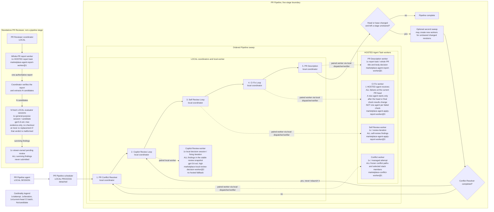

# PR Pipeline execution topology

Ask Copilot: **Show the PR Pipeline execution topology.**

The scheduler runs the five stages in the numbered order. It starts a second sweep only when the pull request head or base changes during the first sweep and a stage is not clear at the final revisions. A completed conflict resolver does not run again in that pipeline run.

Each stage has a local coordinator. For hosted stages, the local Agent Tasks Runtime dispatches the request and verifies the result. It is not a worker session. Copilot Review is different. Its coordinator starts a local `gpt-5.6-sol` session with reasoning effort `high` under `marketplace-local-review-decision-worker@2`, and it has no hosted fallback.

| Stage | Worker cardinality and bundle |
| --- | --- |
| PR Conflict Resolver | One hosted Agent Task per managed attempt. It receives every frozen conflict path and all selected stack members in that attempt. |
| Copilot Review | One local decision session per fixing iteration. It receives all findings in the stable review snapshot. |
| Self Review | One hosted Agent Task per review iteration. It reviews and handles all self-review findings in that iteration. |
| CI Fix | One hosted Agent Task receives all failures and logs at the current pull request head. A new task starts only after the head or final check results change. It is not one task per failed check. |
| PR Description | One hosted report task for the whole pull request title and body decision. |

The CI coordinator owns polling, reruns, stabilization, and snapshot deduplication. Stable means all relevant checks are terminal and the check rollup remains unchanged after debounce. Repeated observations of the same current-head stable final check set do not start another hosted session. It does not deduplicate log content across checks or matrix jobs.

For every failing check, the current coordinator runs `gh run view <run> [--job <job>] --log-failed --allow-escape-sequences`. It stores the complete returned standard output as `failures[].log` with its SHA-256 digest, then JSON-serializes the entire check snapshot into the hosted worker prompt. It does not pass successful-job logs, and `--log-failed` usually limits output to failed steps.

No log compaction exists today. The coordinator does not deduplicate or normalize logs across matrix jobs, truncate them, extract excerpts, or enforce an aggregate prompt byte or token budget. One hundred similar failing matrix jobs can therefore duplicate substantial text in one worker prompt. This is a known scalability gap.

PR Reviewer is a standalone workflow that runs only when invoked directly. PR Pipeline does not call it as a stage or worker. Its local coordinator dispatches one hosted `marketplace-agent-report-worker@1` task for the whole-pull-request authoritative report, verifies the result, and extracts the candidate set against the authoritative diff.

Each candidate goes to one fresh local `general-purpose` evaluator using `gpt-5.6-sol` with reasoning effort `max`. Evaluators are evidence-only. They receive the candidate evidence and relevant diff excerpt, but no checkout. They cannot fetch, inspect, or change the source. A malformed evaluator verdict permits at most one fresh replacement for that candidate. If findings survive evaluation, the coordinator creates one viewer-owned pending review containing all survivors and never submits it.
