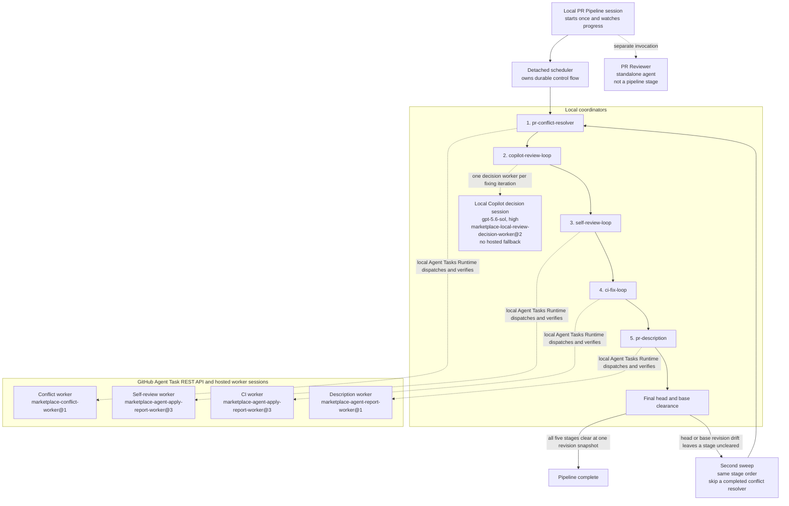

# PR Pipeline execution topology

Ask Copilot: **Show the PR Pipeline execution topology.**

The scheduler runs the five stages in the numbered order. It starts a second sweep only when the pull request head or base changes during the first sweep and a stage is not clear at the final revisions. A completed conflict resolver does not run again in that pipeline run.

Each stage has a local coordinator. For hosted stages, the local Agent Tasks Runtime dispatches the request and verifies the result. It is not a worker session. Copilot Review is different. Its coordinator starts a local `gpt-5.6-sol` session with reasoning effort `high` under `marketplace-local-review-decision-worker@2`, and it has no hosted fallback.

| Stage | Worker session count when work is needed |
| --- | --- |
| PR Conflict Resolver | One hosted Agent Task session per conflict attempt |
| Copilot Review | One local decision session per fixing iteration |
| Self Review | One hosted Agent Task session |
| CI Fix | One hosted Agent Task session per distinct stable CI failing snapshot |
| PR Description | One hosted Agent Task session |

The CI coordinator owns polling, reruns, stabilization, and deduplication. Repeated observations of the same stable CI failing snapshot do not start another hosted session. A changed stable snapshot may start the next one.

PR Reviewer is a standalone agent. PR Pipeline does not call it as a stage or worker.
