# PR Pipeline execution topology

Ask Copilot: **Show the PR Pipeline execution topology.**

```mermaid
flowchart LR
    agent["PR Pipeline agent<br/>local session"]
    scheduler["PR Pipeline scheduler<br/>detached local process"]
    agent --> scheduler

    subgraph pipeline["Five-stage pipeline"]
        direction TB
        conflict["1. Conflict Resolver<br/>result v5, receipt v3<br/>marketplace-conflict-worker@9"]
        copilotReview["2. Copilot Review<br/>local result v3, decision report v2<br/>marketplace-local-review-decision-worker@3"]
        selfReview["3. Self Review<br/>coordinator report v3<br/>code candidate policy @1"]
        ci["4. CI Fix<br/>coordinator report v7, receipt v3<br/>code candidate policy @1"]
        description["5. PR Description<br/>proposal v3<br/>report recommendation policy @1"]
        checks["GitHub checks and statuses<br/>exact published source SHA"]

        conflict --> copilotReview --> selfReview --> ci --> description
        ci -->|"candidate publication stays pending"| checks
        checks -->|"trusted terminal green"| description
    end

    scheduler --> conflict
```

The scheduler runs these stages in order. A second sweep starts only when the head or base changed during the first sweep and at least one stage is not clear at the final revisions. Once Conflict Resolver records a mechanically valid result for the current head and base, or GitHub already reports the pull request mergeable, that stage is clear. A completed resolver is not launched again in the same Pipeline run.

Every stage is an installed Python coordinator subprocess. No model translates its command or exit status. Each coordinator waits for child completion and consumes its own configured iteration allowance. That allowance belongs to the entire run and is neither reset nor multiplied by sweeps. A nonzero exit or unfinished child blocks the Pipeline even if a clearance marker exists. An interrupted run is abandoned; a later invocation starts from the beginning.

Model overrides use canonical IDs, for example `--stage-model pr-description=gpt-6-astra`. PR Description supports `gpt-5.6-sol`, `gpt-5.6-luna`, `gpt-5.6-terra`, and `gpt-6-astra`; the other stages require `gpt-5.6-sol`. The scheduler rejects unsupported routes before launching a stage.

Every stage launch and status read uses a state path derived from the Pipeline run ID. The helpers never fall back to pull-request-wide state. A status envelope must name the exact state file and pull request before its current-head marker can clear a stage. Conflict Resolver also binds the current base. Old owners, reports, results, and clearances cannot enter a fresh run.

`start` creates a random run ID and a versioned monitor handle. The handle binds the canonical target, launch record, and progress log. Each unfinished `watch` response returns the complete arguments for the next call. Callers pass those arguments unchanged. The helpers do not scan for a latest run or reconstruct a target from shared state.

Stack Pipeline uses the same rules. Each run has its own scheduler state, monitor handle, stage state files, worker records, and worktrees. A stack-wide lock permits one active owner for the selected suffix, but no new run resumes or imports a sealed run. Each worker request binds one run ID, nonce, head, base, and role. Native-stack Conflict Resolver runs one task per member in order, collecting committed code only from each task's authoritative generated branch.

Only a full native-stack selection authorizes `--whole-stack` conflict publication. A partial suffix never launches the conflict coordinator. Fresh GitHub mergeability clears each selected member only at its exact head and base. Conflicting, unknown, or stale metadata blocks rather than changing an unselected prefix.

## Hosted outputs

Hosted workers use `.github/agent-task-output/`.

- `report.md` is optional free-form advice. No stage parses it as identity, validation, changed-file evidence, a commit map, or a clearance result.
- Self Review and CI Fix consume Runtime result v5 and candidate manifest v1. The coordinators derive commit parents, trees, patch digests, changed paths, and the code tip.
- Conflict Resolver consumes result v4 and receipt v3. Its coordinator derives each member's candidate tip, replayed history, fix commits, changed paths, and publication mapping from Git before approving the atomic push.
- PR Description requires `.github/agent-task-output/title.txt` and `.github/agent-task-output/body.md`. An optional `report.md` remains inert.
- Copilot Review uses request-bound opaque finding IDs. The local coordinator derives all source and GitHub evidence.

No stage trusts model-authored explanations, identities, SHAs, paths, mappings, validation claims, or canonical reports.

## Stage clearance

| Stage | Clearance rule |
| --- | --- |
| Conflict Resolver | A mechanically valid result names the current head and base, or GitHub already reports the pull request mergeable. Optional report prose does not matter. |
| Copilot Review | The minimized local decision result clears the current head. Under `source-only`, a verified run-bound policy skip is clear with `clean_at_head_sha` set to `null`. |
| Self Review | Terminal candidate handling clears the current head. Zero code commits means clean with no fixes. Imported commits advance the source only through the helper's exact source and publication guards. |
| CI Fix | Candidate publication is pending. Only trusted GitHub checks and statuses bound to the exact published source SHA can record green. The coordinator uses bounded polling and never runs candidate Gradle, Maven, tests, or builds locally. |
| PR Description | A keep result clears without mutation. A replacement applies only when GitHub mutation policy is `allow`. Under `source-only`, the helper keeps the proposal but does not change title or body, so the stage remains uncleared. |

The caller freezes `--github-mutation-policy` at `start`. Both single-PR and stack schedulers forward it to Copilot Review, Self Review, and PR Description. `source-only` permits guarded source publication but forbids comments, reviews, thread changes, draft changes, title changes, body changes, and all other pull request metadata mutation.
