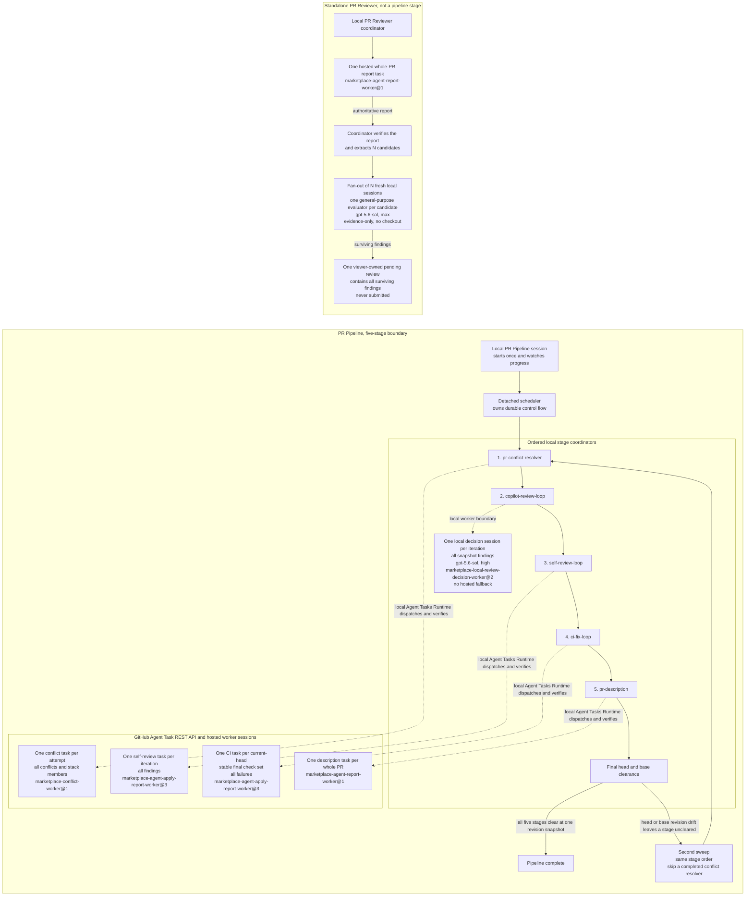

# PR Pipeline execution topology

Ask Copilot: **Show the PR Pipeline execution topology.**

The scheduler runs the five stages in the numbered order. It starts a second sweep only when the pull request head or base changes during the first sweep and a stage is not clear at the final revisions. A completed conflict resolver does not run again in that pipeline run.

Each stage has a local coordinator. For hosted stages, the local Agent Tasks Runtime dispatches the request and verifies the result. It is not a worker session. Copilot Review is different. Its coordinator starts a local `gpt-5.6-sol` session with reasoning effort `high` under `marketplace-local-review-decision-worker@2`, and it has no hosted fallback.

| Stage | Worker cardinality and bundle |
| --- | --- |
| PR Conflict Resolver | One hosted Agent Task per attempt. It receives all conflicts and every stack member in that attempt. |
| Copilot Review | One local decision session per iteration. It receives all findings in the frozen review snapshot. |
| Self Review | One hosted Agent Task per iteration. It reviews and handles all findings in that iteration. |
| CI Fix | One hosted Agent Task per current-head stable final check set. It receives all failures in that set. A new task starts only after the head or final check results change. |
| PR Description | One hosted Agent Task for the whole pull request. |

The CI coordinator owns polling, reruns, stabilization, and snapshot deduplication. Repeated observations of the same current-head stable final check set do not start another hosted session. It does not deduplicate log content across checks or matrix jobs.

For every failing check, the current coordinator runs `gh run view <run-id> [--job <job-id>] --log-failed --allow-escape-sequences`. It embeds the complete returned standard output for that check and its SHA-256 digest in the worker prompt. There is no cross-matrix log deduplication, truncation, excerpting, or aggregate prompt budget.

PR Reviewer is a standalone workflow that runs only when invoked directly. PR Pipeline does not call it as a stage or worker. Its local coordinator dispatches one hosted `marketplace-agent-report-worker@1` task for the whole-pull-request authoritative report, verifies the result, and extracts the candidate set against the authoritative diff.

Each candidate goes to one fresh local `general-purpose` evaluator using `gpt-5.6-sol` with reasoning effort `max`. Evaluators are evidence-only. They receive the candidate evidence and relevant diff excerpt, but no checkout. They cannot fetch, inspect, or change the source. If findings survive evaluation, the coordinator creates one viewer-owned pending review containing all survivors and never submits it.
