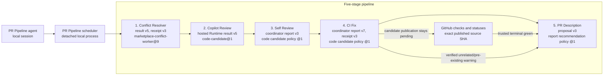

# PR Pipeline execution topology

Ask Copilot: **Show the PR Pipeline execution topology.**

The scheduler runs these stages in order. A second sweep starts only when the head or base changed during the first sweep and at least one stage is not clear at the final revisions. Once Conflict Resolver records a mechanically valid result for the current head and base, or GitHub already reports the pull request mergeable, that stage is clear. A completed hosted resolution is not launched again in the same Pipeline run. A later sweep can refresh mergeability-only clearance at the current head and live base without starting another task or resetting the stage budget.

Every stage is an installed Python coordinator subprocess. No model translates its command or exit status. Each coordinator waits for child completion and consumes its own configured iteration allowance. That allowance belongs to the entire run and is neither reset nor multiplied by sweeps. A nonzero exit or unfinished child blocks the Pipeline even if a clearance marker exists. An interrupted run is abandoned; a later invocation starts from the beginning.

Model overrides use canonical IDs, for example `--stage-model pr-description=gpt-6-astra`. PR Description supports `gpt-5.6-sol`, `gpt-5.6-luna`, `gpt-5.6-terra`, and `gpt-6-astra`; the other stages require `gpt-5.6-sol`. The scheduler rejects unsupported routes before launching a stage.

Every stage launch and status read uses a state path derived from the Pipeline run ID. The helpers never fall back to pull-request-wide state. A status envelope must name the exact state file and pull request before its current-head marker can clear a stage. Conflict Resolver also binds the current base. Old owners, reports, results, and clearances cannot enter a fresh run.

`start` creates a random run ID and a versioned monitor handle. The handle binds the canonical target, launch record, and progress log. Each unfinished `watch` response returns the complete arguments for the next call. Callers pass those arguments unchanged. The helpers do not scan for a latest run or reconstruct a target from shared state.

Standalone `watch` exposes its terminal summary directly as `final_event`, including on a repeated terminal watch with no new updates. Before publishing that summary, the scheduler saves the complete controller event to the run's `result.json`. `final_event.artifacts.result` names the canonical file; `result_sha256` in the same object hashes its exact bytes. Artifact failures are explicit reporting or monitoring failures, never successful pipeline outcomes.

Both the standalone terminal summary and the entire watch response fit within 8,192 serialized UTF-8 bytes, including JSON escaping, spacing, and the trailing newline. This uses Stack Pipeline's terminal-summary budget. Collections and text previews carry `*_omitted` counts or flags and `*_details_truncated` flags. Read the exact full artifact when those flags affect the response. The summary aggregates published and retained commits and tracking errors across all runs, but the full artifact preserves their original locations and all diagnostic data. Routine successful-stage status/history is marked `diagnostics_omitted`; a clean no-change response does not need that detail.

`artifacts.progress` on the watch envelope names the progress journal. `updates_omitted` and per-update `details_truncated` identify bounded progress previews. The cursor still covers all journaled records, and unfinished responses preserve `next_watch.arguments`. A compact terminal event may also appear in the last update when both copies fit, but consumers must use top-level `final_event`. No reporting omission changes stage execution or authorizes a relaunch.

Stack Pipeline uses the same rules. Each run has its own scheduler state, monitor handle, stage state files, worker records, and worktrees. A stack-wide lock permits one active owner for the selected suffix, but no new run resumes or imports a sealed run. Each worker request binds one run ID, nonce, head, base, and role. Native-stack Conflict Resolver runs one task per member in order, collecting committed code only from each task's authoritative generated branch.

Stack worker cleanup removes only clean, owned worktrees through ordinary `git worktree remove`. Dirty worktrees, unreadable status, and removal failures retain the workspace and ownership record. The full `result.json` lists retained paths and reasons under `pipeline_result.cleanup`; it also preserves each worker's stage-result evidence under `pipeline_result.pull_requests`. Retention does not authorize replay, publication, or a replacement worker.

An exit code of zero and changed heads do not establish conflict-stage completion. Conflict Resolver must record a terminal outcome before Stack Pipeline starts review. A recorded `completed` outcome without current clearance can continue the bounded pass, but cannot clear the conflict stage or make the final snapshot complete. An absent outcome blocks with `conflict_did_not_record_outcome`.

Only a full native-stack selection authorizes `--whole-stack` conflict publication. A partial suffix never launches the conflict coordinator. Fresh GitHub mergeability clears each selected member only at its exact head and base. Conflicting, unknown, or stale metadata blocks rather than changing an unselected prefix.

Both CI push propagation and predecessor alignment pass a versioned `--stack-request` and explicit run-scoped `--state` to Conflict Resolver. The request binds the active owner, original selected order and topology, fixed PR/head, canonical repository, and current source heads. Full-stack conflict dispatch carries the same authorization. New members, reordered or removed members, changed refs, or changed source heads block before hosted work and before publication.

Descendant propagation uses the hosted conflict worker and its verified receipts, not local rebase/format/repair commands. Only authorized descendants enter its atomic push, each with an exact source-head lease. One hosted attempt belongs to each frozen propagation request. A controlled publication failure can retry those verified candidates within the same active run, without another hosted task or a fresh budget. Interrupted, foreign, and legacy state cannot publish, finalize receipts, or remove retained workspaces.

## Hosted outputs

Hosted workers use `.github/agent-task-output/`.

- `report.md` is optional free-form advice. No stage parses it as identity, validation, changed-file evidence, a commit map, or a clearance result.
- Self Review and CI Fix consume Runtime result v5 and candidate manifest v1. The coordinators derive commit parents, trees, patch digests, changed paths, and the code tip.
- Conflict Resolver consumes result v5 and receipt v3. Its coordinator derives each member's candidate tip, replayed history, fix commits, changed paths, and publication mapping from Git before approving the atomic push.
- PR Description requires `.github/agent-task-output/title.txt` and `.github/agent-task-output/body.md`. An optional `report.md` remains inert.
- Copilot Review consumes pinned Runtime `code-candidate@1` result v5. The hosted task produces at most one code commit and a separate `review-decisions.json` artifact using request-bound opaque finding IDs. The controller uses the pinned Runtime Git history verifier and independently checks candidate, task, session, model, prompt, and finding identity. Local source and GitHub snapshots must remain unchanged until code-only import. The local controller handles identity, guards, import, and publication, not semantic review.

No stage trusts model-authored explanations, identities, SHAs, paths, mappings, validation claims, or canonical reports.

## Stage clearance

| Stage | Clearance rule |
| --- | --- |
| Conflict Resolver | A mechanically valid result names the current head and base, or GitHub already reports the pull request mergeable. Optional report prose does not matter. |
| Copilot Review | The controller's current-head review marker clears the stage after verified hosted candidate handling. A hosted decision artifact alone cannot clear the stage. Under `source-only`, a verified run-bound policy skip is clear with `clean_at_head_sha` set to `null`. |
| Self Review | Terminal candidate handling clears the current head. Zero code commits means clean with no fixes. Imported commits advance the source only through the helper's exact source and publication guards. |
| CI Fix | Candidate publication is pending. Only trusted GitHub checks and statuses bound to the exact published source SHA can record green. A coordinator-verified diagnosis of unrelated or pre-existing failures can instead clear orchestration with CI warnings at the exact head and base, never a clean marker. Unknown failures remain uncleared. The coordinator uses bounded polling and never runs candidate Gradle, Maven, tests, or builds locally. |
| PR Description | A keep result clears without mutation. A replacement applies only when GitHub mutation policy is `allow`. Under `source-only`, the helper keeps the proposal but does not change title or body, so the stage remains uncleared. |

The caller freezes `--github-mutation-policy` at `start`. Both single-PR and stack schedulers forward it to Copilot Review, Self Review, CI Fix, and PR Description. `allow` permits bounded, guarded failed-job reruns through CI Fix. `source-only` permits guarded source publication but forbids reruns, comments, reviews, thread changes, draft changes, title changes, body changes, and all other pull request metadata mutation. No policy permits empty commits as a rerun workaround.

CI warning clearance requires `stage_outcome: "warning"`, `clean_at_head_sha: null`, exact `warning_at_head_sha` and `warning_at_base_sha` markers, and a nonempty `ci_warnings` list. Each entry names its `check_key`, `name`, `diagnosis` of `unrelated` or `pre_existing`, nonempty `reason`, and nonempty string `evidence` list. The CI coordinator derives these warnings from a fresh completed hosted task. Pipeline reads only its run-bound status envelope, never a hosted report or an old task.

Every CI status read passes `--verify-warning-snapshot`. Warning clearance also requires `warning_verification.result: "current"`, reason `ci_warning_snapshot_current`, and matching 64-digit SHA-256 values in `expected_snapshot_sha256` and `observed_snapshot_sha256`. CI owns the live comparison of the entire visible check snapshot, including failed run attempts. Changed checks at the same head and base invalidate warnings; unreadable snapshots never count as current. Status verification neither starts work nor resets a budget.

Warnings remain visible while review and description work continues. Unchanged warning clearance does not spend another CI attempt; head, base, or check snapshot movement invalidates it. In a stack, the helper revalidates a warning-cleared predecessor before releasing its successor, including after descendant alignment. The descendant must still contain its head. This does not filter failures by required-check status or repository-specific rules.

A finished workflow retains `result: "complete"` for compatibility. With current CI warnings, its terminal result also contains `ci_warnings` and `all_ci_passed: false`, and observers report **completed WITH CI WARNINGS**, never all CI green. Standalone summaries set `all_ci_passed: true` only when the final CI stage's clearance and controller green evidence match the current head and base. Missing evidence leaves the field absent; completion alone does not imply green. Historical run warnings do not become current clearance, and a warning-revalidation error remains visible without reusing old warnings. Stack warnings include each affected pull request's `number`, `head_sha`, and `base_sha`. Both bounded terminal events point to their full result artifacts when warning details are omitted or truncated.
