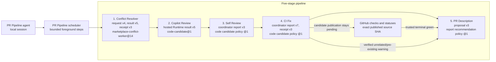

# PR Pipeline execution topology

Ask Copilot: **Show the PR Pipeline execution topology.**

The scheduler runs these stages in order. A second sweep starts when the head or base changed during the first sweep and at least one stage is not clear at the final revisions. On unchanged revisions, it also starts when the sole uncleared stage is CI and fresh verification shows that its green or warning snapshot changed; no other unchanged-stage result starts another sweep. Conflict Resolver pins the base for hosted work, accepts a forward advance of the live target branch, and checks mergeability at the verified PR head. A rewritten base still blocks publication. A later sweep can refresh incomplete mergeability or CI snapshot evidence without resetting the stage budget.

Every stage is an installed Python coordinator. The PR Pipeline custom agent calls `start` once and then calls `advance` in the same Copilot session until the run finishes. A local stage step has no elapsed-time deadline: it runs to a sealed result or explicit cancellation, then returns `continue`, `waiting`, or a final result. Conflict Resolver can prepare a native stack before dispatching a hosted task. When hosted work is active, the stage records its exact identity and the agent makes a later observation call; no local process needs to wait for the hosted task. No model translates a stage's command or exit status into clearance. Each coordinator consumes its own configured iteration allowance across the whole run. A nonzero exit or unfinished child blocks the Pipeline even if a clearance marker exists. An interrupted session leaves its run incomplete; a later session starts a fresh run, not an automatic continuation.

The published PR head is the input to every stage, not the caller's checked-out branch. Single-PR Pipeline requires a clean worktree, fetches the current PR head, and checks it out even when a stack restack has rewritten the branch history. Before leaving a local tip that is not an ancestor of the fetched head, it retains that tip at `refs/copilot/pr-pipeline/<run-id>/<pr-number>/<sha>` and reports the ref in `checkout_head_retained`; a failed retention blocks checkout. A named local branch is left unchanged. The retained tip is recoverable but does not become part of the published PR, and a stage that leaves unpublished commits or a dirty worktree still blocks. Stack Pipeline already starts its owned worker worktrees at exact PR heads and keeps its separate ownership and publication checks.

Verified Review exhaustion is terminal `carried`, not clean. Pending feedback and spent allowance remain in its status while Self Review, CI and Description continue. Later sweeps cannot turn exhaustion into another allowance. The final result stays incomplete or partial while Review remains unresolved.

When a stage proves that its completed hosted candidate was based on an older source head, the schedulers retain that evidence but do not adopt, import, rebase, or publish the candidate. The started stage allowance remains spent. The stage stays uncleared, and only a later sweep or pass that was already within the two-iteration limit may evaluate and clear the current snapshot.

Both schedulers load `pipeline_common.py` from its pinned source bytes without reading or writing installed bytecode caches or changing interpreter-wide bytecode settings. A shared-source change requires updating both scheduler digest pins.

Model overrides use canonical IDs, for example `--stage-model pr-description=gpt-6-sol`. PR Description supports `gpt-6-sol`, `gpt-5.6-luna`, `gpt-5.6-terra`, and `gpt-6-astra`; the other stages require `gpt-6-sol`. These select the local coordinator model; hosted Sol Agent Tasks use `gpt-5.6-sol`. The scheduler rejects unsupported routes before launching a stage.

Every stage launch and status read uses a state path derived from the Pipeline run ID. The helpers never fall back to pull-request-wide state. Read-only stage status commands do not load the execution Runtime when they inherit an owned subprocess environment. A status envelope must name the exact state file and pull request. Clearance follows the verified PR head and the stage's current inputs, not an unrelated target-branch tip change. Old owners, reports, results, and clearances cannot enter a fresh run.

Description status reads pass `--verify-clearance-snapshot`. Successful KEEP and replacement publication record the final validated title and body bytes, head, branch identities, draft state, and authenticated viewer permissions. Status compares the decision inputs with fresh authenticated metadata; the recorded base tip remains provenance, not a clearance guard. It never rewrites a receipt, starts a task, or spends an iteration. Missing historical identity is not reconstructed. Changed or unreadable decision inputs cannot clear the stage.

On a later sweep of the same run, Copilot Review accepts a changed title or body only when the prior sweep's run-bound Description state records a completed, applied proposal from Review's saved metadata to the exact current metadata, with matching validated head, base, branch identities, and clearance snapshot. Other metadata changes still fail the source identity check.

On a later native pass, an unchanged member reuses Description only when this run already collected its accepted exit-zero completion and its recorded snapshot is still current. The invocation, model, mutation policy, and earlier pass must match. Other members whose heads advanced still run Description normally. Invalid same-head clearance blocks without another semantic evaluation; Description's once-per-head guard remains in force. Phase and terminal results list reused members separately from dispatched workers and accepted completions, including when all members reuse clearance. A failed worker exit always blocks even if its state retains an older clear marker.

## Foreground ownership

The custom agent uses `start <target>`, then `advance <target> --run-id <id>`
through the shared, source-pinned Runtime execution library. Every call has
a fresh execution root; the pipeline run ID and its stage state remain bound
to the original Copilot agent session. The agent reads the sealed result of
each call, waits only between calls, and advances without asking for another
user instruction. The original synchronous `run <target>` command remains
available for standalone compatibility but is not the custom agent's route.
`execution-status` reads the sole live root, or the latest unambiguous
terminal root, for this session and helper. `execution-cancel` requests local
cancellation only when exactly one matching live root exists. Neither observer
disconnection nor tool-shell exit establishes cancellation or completion.

Stage sequencing remains in these schedulers. Children inherit each step's
execution identity, bind their own process generations and write their own
readiness. Output and results are file-backed. A sealed `waiting` step means
the local step finished, not that its stage cleared; the next call observes
the exact pending task and validates its result before publication. An
unfinished or unverified child blocks completion. Cancelled or failed steps
retain task identities and spent budgets rather than starting a replacement.
Hosted tasks may continue after local cancellation.

Both Pipeline and Conflict require the shared Runtime execution library;
Conflict retains its dedicated hosted backend. No app-native Stop integration,
automatic recovery, app-shutdown survival or remote cancellation is promised.
The agent session must stay active to advance the Pipeline. Foreground roots
create their own execution identities and reject caller-supplied execution
handles. `advance` accepts only the Pipeline run ID bound to that session;
it cannot adopt an earlier execution root.

## Terminal reporting

Both helpers persist the canonical result before deriving a terminal summary. `artifacts.result` names that file and `artifacts.result_sha256` hashes its exact bytes. Artifact failures are explicit reporting failures, never successful pipeline outcomes.

Terminal summaries fit within 8,192 serialized UTF-8 bytes, including JSON escaping, spacing, and the trailing newline. Collections and text previews carry `*_omitted` counts or flags and `*_details_truncated` flags. Read the exact full artifact when those flags affect the response. The standalone summary aggregates published and retained commits and tracking errors across all runs, but the full artifact preserves their original locations and all diagnostic data. Routine successful-stage status/history is marked `diagnostics_omitted`; a clean no-change response does not need that detail.

When the stopping stage retains an `agent_task.error`, both summaries expose it separately as `stage_failure.error`, with the stage and, for Stack Pipeline, the affected pull request number. Structured errors use their nonempty string `code` and `message` fields, for example `stale_target: pull request target changed`. This diagnostic never replaces the top-level safety `reason` or `detail`. Error and stage-name previews are limited to 512 characters; `error_details_truncated` or `stage_details_truncated` inside `stage_failure`, or a top-level `stage_failure_omitted` flag, requires reading the full artifact. Historical stage errors are not substitutes for the terminal stop. If Stack terminal metadata alone exceeds the byte limit, reporting fails explicitly without changing the durable result.

## Stack controller

Stack Pipeline uses the same clearance rules. Each run has its own scheduler state, stage state files, worker records, and worktrees. No branch or stack admission lock coordinates separate runs. An exact run state path is still sealed against replay, and ordinary atomic writes protect each run's files. Each worker request binds one run ID, nonce, head, base, and role. Native-stack Conflict Resolver runs one task per member in order, collecting committed code only from each task's authoritative generated branch.

Stack worker cleanup removes only clean, owned worktrees through ordinary `git worktree remove`. Dirty worktrees, unreadable status, and removal failures retain the workspace and ownership record. The full `result.json` lists retained paths and reasons under `pipeline_result.cleanup`; it also preserves each worker's stage-result evidence under `pipeline_result.pull_requests`. Retention does not authorize replay, publication, or a replacement worker.

An exit code of zero and changed heads do not establish conflict-stage completion. Conflict Resolver must record a terminal outcome before Stack Pipeline starts review. A recorded `completed` outcome without current clearance can continue the bounded pass, but cannot clear the conflict stage or make the final snapshot complete. An absent outcome blocks with `conflict_did_not_record_outcome`.

Stack Pipeline launches the conflict coordinator only when its selected suffix is the complete open native stack. A partial suffix never changes an unselected prefix. Ordinary PR Pipeline passes no stack scope. Conflict Resolver detects native-stack work, creates a run-bound authorization for every current open member, and rechecks the complete topology and exact source heads before atomic publication.

For an already-mergeable whole stack, Conflict Resolver records one aggregate clearance in the clicked member's state without starting hosted work. The final snapshot can use that evidence for members with no conflict state only after this run accepted the producer's successful completion. The authorization, invocation, configuration, ordered topology, and every member's current head and direct base must still match. This creates no child receipts, cannot override existing child conflict failures or stale state, and does not clear any other stage.

Both CI push propagation and predecessor alignment pass a versioned `--stack-request` and explicit run-scoped `--state` to Conflict Resolver. The request binds the active owner, original selected order and topology, fixed PR/head, canonical repository, and current source heads. Full-stack conflict dispatch carries the same authorization. New members, reordered or removed members, changed refs, or changed source heads block before hosted work and before publication.

Descendant propagation uses the hosted conflict worker and its verified receipts, not local rebase/format/repair commands. Only authorized descendants enter its atomic push, each with an exact source-head lease. One hosted attempt belongs to each frozen propagation request. A controlled publication failure can retry those verified candidates within the same active run, without another hosted task or a fresh budget. Interrupted, foreign, and legacy state cannot publish, finalize receipts, or remove retained workspaces.

Conflict request v4 pins source identities and replay order without a precomputed path list. Hosted workers find conflict locations in Git and may make necessary scoped companion changes and relocate tests while preserving both sides' intent and behavior. A stale-base native-stack merge is resolved on a hosted candidate branch without requiring the old tree; exact-direct-base normalization still requires its recorded tree. Both local verifiers retain unsafe-path and reserved-output checks, member order, source identity, attribution and history checks. Structural acceptance does not prove a candidate correct.

## Hosted outputs

Hosted workers use `.github/agent-task-output/`.

- `report.md` is optional free-form advice. No stage parses it as identity, validation, changed-file evidence, a commit map, or a clearance result.
- Self Review and CI Fix consume Runtime result v5 and candidate manifest v1. The coordinators derive commit parents, trees, patch digests, changed paths, and the code tip.
- Self Review requires `self-review-result.json` with only `outcome` and `iterations_used`. One hosted loop gets the remaining allowance. Review passes, task counts and publications differ; zero commits alone proves neither clean nor exhausted.
- Conflict Resolver consumes result v5 and receipt v3. Its coordinator derives each member's candidate tip, replayed history, fix commits, changed paths, and publication mapping from Git before approving the atomic push.
- PR Description requires `.github/agent-task-output/title.txt` and `.github/agent-task-output/body.md`. An optional `report.md` remains inert.
- Copilot Review consumes pinned Runtime `code-candidate@1` result v5. The hosted task produces at most one code commit and a separate `review-decisions.json` artifact using request-bound opaque finding IDs. The controller uses the pinned Runtime Git history verifier and independently checks candidate, task, session, model, prompt, and finding identity. Local source and GitHub snapshots must remain unchanged until code-only import. The local controller handles identity, guards, import, and publication, not semantic review.

Required workflow-specific semantic outputs remain untrusted input checked by their owning coordinator. Workers do not restate dispatcher identity, SHAs, parents or path inventories. A semantic outcome never proves GitHub CI green.

## Stage clearance

| Stage | Clearance rule |
| --- | --- |
| Conflict Resolver | A mechanically valid result names the current head and verifies live mergeability, or GitHub already reports the pull request mergeable. Native-stack members also require their direct parent-branch base to match. Optional report prose does not matter. |
| Copilot Review | Current head and actual base markers clear the stage after verified hosted candidate handling. Exhaustion is carried and unresolved. Under `source-only`, a verified run-bound policy skip is clear with `clean_at_head_sha` set to `null`. |
| Self Review | A verified explicit hosted clean outcome clears the published head. Exhaustion stays unresolved; incomplete output cannot authorize import. Zero commits alone does not clear the stage. |
| CI Fix | Candidate publication is pending. Only trusted GitHub checks and statuses bound to the exact published source SHA can record green. A coordinator-verified diagnosis of unrelated or pre-existing failures can instead clear orchestration with CI warnings for that head, never a clean marker. Unknown failures remain uncleared. The coordinator uses bounded polling and never runs candidate Gradle, Maven, tests, or builds locally. |
| PR Description | A keep result clears without mutation. A replacement applies only when GitHub mutation policy is `allow`. Under `source-only`, the helper keeps the proposal but does not change title or body, so the stage remains uncleared. |

The caller freezes `--github-mutation-policy` at `start` (or `run` for the synchronous route). Both single-PR and stack schedulers forward it to Copilot Review, Self Review, CI Fix, and PR Description. `allow` permits bounded, guarded failed-job reruns through CI Fix. `source-only` permits guarded source publication but forbids reruns, comments, reviews, thread changes, draft changes, title changes, body changes, and all other pull request metadata mutation. No policy permits empty commits as a rerun workaround.

CI warning clearance requires `stage_outcome: "warning"`, `clean_at_head_sha: null`, exact `warning_at_head_sha` and `warning_at_base_sha` markers, and a nonempty `ci_warnings` list. Each entry names its `check_key`, `name`, `diagnosis` of `unrelated` or `pre_existing`, nonempty `reason`, and nonempty string `evidence` list. The CI coordinator derives these warnings from a fresh completed hosted task. Pipeline reads only its run-bound status envelope, never a hosted report or an old task.

Every CI status read passes `--verify-clearance-snapshot`. Green and warnings require current verification with matching snapshot fingerprints. CI compares all visible checks and current workflow attempts, including newly started same-head runs absent from the rollup. Changed checks at the same head invalidate clearance; target-branch tip movement alone does not. Unreadable snapshots never count as current. Status verification neither starts hosted work nor resets a budget.

When a later Review commit advances the same head branch, CI status reports its old green or warning clearance as stale without fetching checks for the obsolete head. It confirms the new commit descends from the saved head and keeps branch identity fixed. Pipeline can then run CI at the new revision; a rewritten head or changed branch remains an identity error.

Warnings remain visible while review and description work continues. Unchanged clearance does not spend another CI attempt. Final completion revalidates green and warnings. In a stack, the helper revalidates either kind of predecessor clearance before releasing its successor, including after descendant alignment. The descendant must still contain its head. This does not filter failures by required-check status or repository-specific rules.

A finished workflow retains `result: "complete"` for compatibility. With current CI warnings, its terminal result also contains `ci_warnings` and `all_ci_passed: false`, and observers report **completed WITH CI WARNINGS**, never all CI green. Standalone summaries set `all_ci_passed: true` only when the final CI stage's clearance and controller green evidence match the current head and recorded check snapshot. Missing evidence leaves the field absent; completion alone does not imply green. Historical run warnings do not become current clearance, and a warning-revalidation error remains visible without reusing old warnings. Stack warnings include each affected pull request's `number`, `head_sha`, and `base_sha`. Both bounded terminal events point to their full result artifacts when warning details are omitted or truncated.
